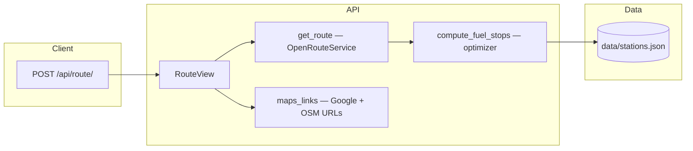
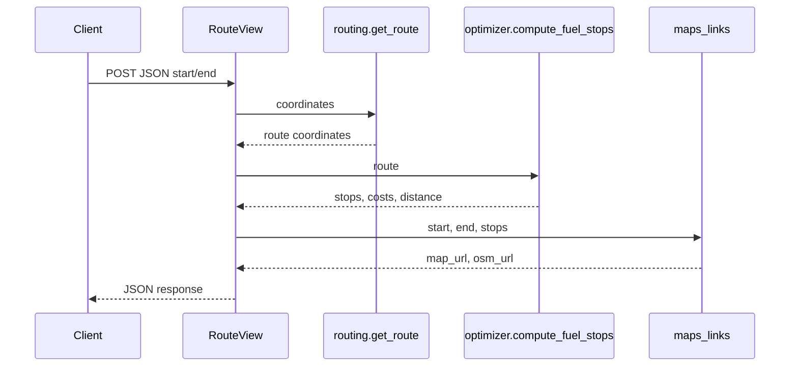

# Fuel API

Django REST API that plans a driving route between two coordinates, estimates **fuel stops** along the path using retail diesel prices, and returns **shareable map links** (Google Maps and OpenStreetMap).

## Requirements

- Python **3.12+**
- [uv](https://github.com/astral-sh/uv) (recommended) or another virtualenv tool

### Tool versions (from `uv.lock`)

| Tool / library | Version |
|----------------|---------|
| Python | 3.12+ (`requires-python` in `pyproject.toml`) |
| Django | 6.0.4 |
| Django REST framework | 3.17.1 |
| python-dotenv | 1.2.2 |
| requests | 2.33.1 |
| polyline | 2.0.4 |
| Docker base image | `python:3.12-slim-bookworm` (`Dockerfile`) |

After changing dependencies, run `uv lock` and commit the updated `uv.lock`.

## Setup

```bash
cd fuel-api
uv sync
cp .env.example .env
```

Edit `.env`:

| Variable | Purpose |
|----------|---------|
| `ORS_API_KEY` | [OpenRouteService](https://openrouteservice.org/) API key for driving directions |
| `GOOGLE_API_KEY` | Google Geocoding API key (only needed to build/regenerate `data/stations.json` from CSV) |
| `DJANGO_SECRET_KEY` | Optional; overrides the dev default in `config/settings.py` |

## Run the server

```bash
uv run python manage.py runserver
```

The API listens at `http://127.0.0.1:8000/` by default.

## Docker

Copy `.env.example` to `.env` and set **`ORS_API_KEY`** (and optionally other keys).

```bash
docker build -t fuel-api .
docker run --rm -p 8000:8000 --env-file .env fuel-api
```

API: `http://127.0.0.1:8000/api/route/`.

## API

### `POST /api/route/`

Request body (JSON):

```json
{
  "start": [-87.6298, 41.8781],
  "end": [-93.265, 44.9778]
}
```

Coordinates are **`[longitude, latitude]`** (same order as GeoJSON).

**Success (200)** — example shape:

```json
{
  "summary": {
    "total_distance": 406.42,
    "total_cost": 135.21,
    "stops_count": 1
  },
  "stops": [
    {
      "name": "KWIK TRIP #497",
      "lat": 44.731554,
      "lon": -93.177966,
      "price": 3.474,
      "distance_from_start": 389.21
    }
  ],
  "map_url": "https://www.google.com/maps/dir/...",
  "osm_url": "https://www.openstreetmap.org/directions?..."
}
```

**Validation error (400)** — invalid or missing `start` / `end`.

**Server error (500)** — routing or processing failure (check response body).

### Example `curl`

```bash
curl -X POST http://127.0.0.1:8000/api/route/ \
  -H "Content-Type: application/json" \
  -d '{"start": [-87.6298, 41.8781], "end": [-93.265, 44.9778]}'
```

## How it works (high level)



1. **Routing** — Fetches a driving route and decodes the geometry (polyline) into a list of `[lon, lat]` points.
2. **Optimization** — Walks the route, finds nearby stations from `data/stations.json`, and picks stops subject to tank range and price heuristics. Fuel cost uses miles driven since the last stop ÷ MPG × station price.
3. **Map links** — Builds ordered waypoint URLs for Google Maps and OSM directions.



## Station data

- **`data/fuel-prices.csv`** — source rows (OPIS-style truck stop listing + retail price).
- **`data/stations.json`** — geocoded stations used at runtime (name, lat, lon, price, optional address fields).

To rebuild `stations.json` from the CSV (calls Google Geocoding; uses `data/geocode_cache.json` to avoid duplicate requests):

```bash
# optional: limit rows while testing
GEOCODE_LIMIT_ROWS=200 uv run python scripts/geocode_stations.py

# full dataset
GEOCODE_LIMIT_ROWS=0 uv run python scripts/geocode_stations.py
```

## Tests

```bash
uv run python manage.py test api -v 2
```

- `api/tests/test_views.py` — HTTP contract and error handling (external services mocked).
- `api/tests/test_optimizer.py` — fuel stop logic (distance/cost rules with controlled mocks).

## Project layout (short)

| Path | Role |
|------|------|
| `api/views.py` | `POST /api/route/` entrypoint |
| `api/serializers.py` | Request validation |
| `api/services/routing.py` | OpenRouteService client + polyline decode |
| `api/services/optimizer.py` | Stop selection and cost |
| `api/services/fuel.py` | Load `stations.json` |
| `api/services/maps_links.py` | Google Maps + OSM URL builders |
| `scripts/geocode_stations.py` | CSV → geocoded JSON |
